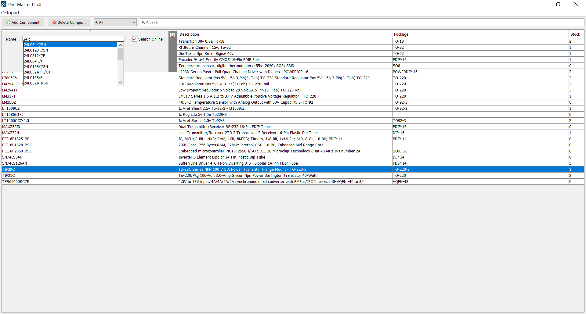

# Part Master

## Introduction

### What is it?
Part Master is an inventory tracking software for electronic components, especially integrated circuits (ICs). It features a minimalistic design with automatic retrieval of parts using the Octopart API.

### Who's it for?
Part Master is mainly intended for electronics hobbyists who have amassed enough chips to rival a McDonald's :) This tool will hopefully help keep track of the inventory and allow you to quickly search through it.

## Installation
The current releases are provided as JAR files. Simply open a JAR file to run the program. A recent Java Runtime Environment (JRE) is required.

## Screenshots

